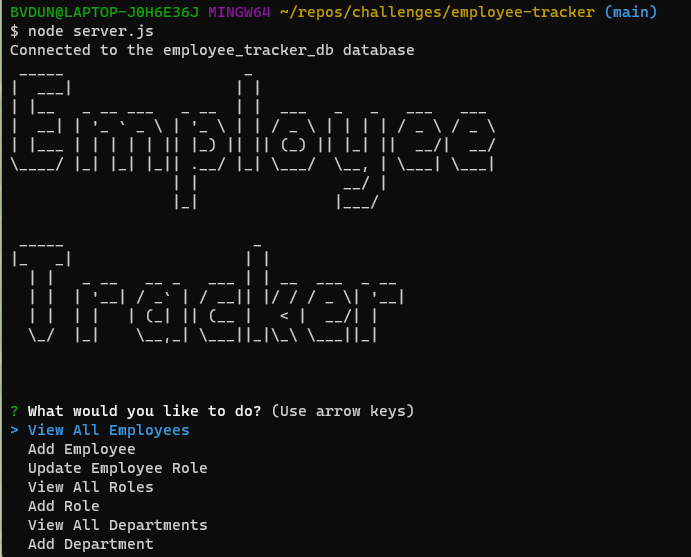

# employee-tracker

## Description
The employee tracker is a content management system (CMS). It is a command-line application that can be used to manage a company's employee database.

### User-Story
AS A business owner

I WANT to be able to view and manage the departments, roles, and employees in my company

SO THAT I can organize and plan my business

### Acceptance-Criteria
GIVEN a command-line application that accepts user input

WHEN I start the application

THEN I am presented with the following options: view all departments, view all roles, view all employees, add a department, add a role, add an employee, and update an employee role

WHEN I choose to view all departments

THEN I am presented with a formatted table showing department names and department ids

WHEN I choose to view all roles

THEN I am presented with the job title, role id, the department that role belongs to, and the salary for that role

WHEN I choose to view all employees

THEN I am presented with a formatted table showing employee data, including employee ids, first names, last names, job titles, departments, salaries, and managers that the employees report to

WHEN I choose to add a department

THEN I am prompted to enter the name of the department and that department is added to the database

WHEN I choose to add a role

THEN I am prompted to enter the name, salary, and department for the role and that role is added to the database

WHEN I choose to add an employee

THEN I am prompted to enter the employee’s first name, last name, role, and manager, and that employee is added to the database

WHEN I choose to update an employee role

THEN I am prompted to select an employee to update and their new role and this information is updated in the database

### Mock-Up

Employee Tracker start screen

Employee Tracker ERD

## Installation-Execution
Walkthrough video:

<video width='320' height='240' controls>
<source src="./Assets/challenge12.mp4" type='video/mp4'>
</video>

Open a command terminal, go to the employee-tracker folder.

Open mysql and create the database and seed it:

1. mysql -uroot -p

2. source db/schema.sql

3. source db/seeds.sql

Quit mysql and start the employee-tracker:

node server.js

Once you are in the Employee Tracker cli interface, you can do the following:

1. View All Employees will display a table showing the employee's id, first and last name, role (job title), salary, department and manager's first and last name.

2. View All Departments will display a table showing department ids and names.

3. View All Roles will display a table showing role ids, names (titles) and the department that the role belongs too, along with the salary.

4. Add An Employee will prompt for the new employee's first and last name, role, and manager name. This information will be stored in the database under the new employee.

5. Add a Role will prompt for the new role's name (title) and the salary and title that go with that role. This information will be stored in the database under the new role.

6. Add a Department will prompt for the new department's name. This information will be stored in the database under the new department.

7. Update Employee's role will prompt for the employee to update and the role to update the employee to. This information will be updated stored in the database.

Enter <ctrl>C to quit.

## Usage

The employee tracker is a content management system (CMS). It is a command-line application that can be used to manage a small company's employee database.

At this time, there are many more options that can be added to this app to make it more flexible as a small CRM. 

## Testing
N/A

## Credits
N/A

## License
N/A